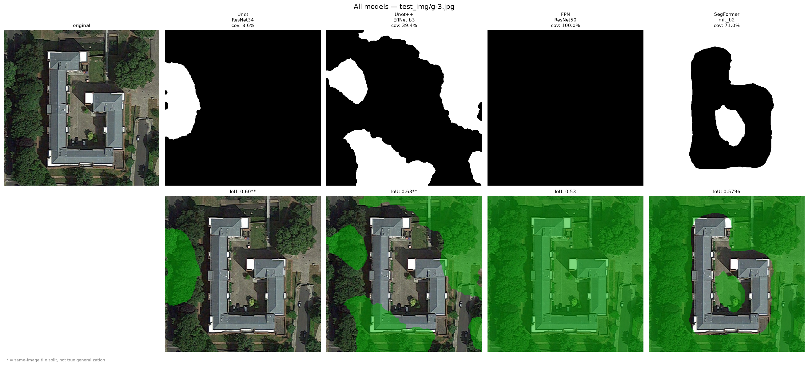
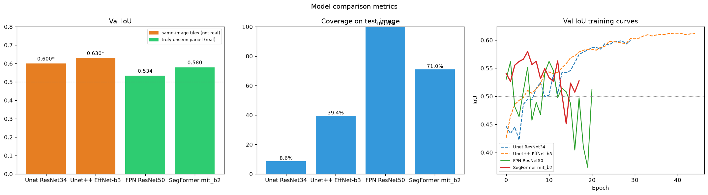

# Ottermap - Aerial Turf Segmentation

A computer vision pipeline that detects and segments turf / grass areas from aerial imagery, producing visual overlays and GIS-compatible GeoJSON outputs. Built as part of the Ottermap 72-hour ML Engineer Intern challenge.

---

## Quick start

### 1. Clone the repo

```bash
git clone https://github.com/YOUR_USERNAME/YOUR_REPO_NAME.git
cd YOUR_REPO_NAME
```

### 2. Install dependencies

```bash
pip install torch torchvision transformers segmentation-models-pytorch \
            albumentations opencv-python-headless pillow shapely \
            rasterio matplotlib
```

### 3. Run inference

```bash
python inference.py --image your_aerial_image.tif
```

Three files are saved to `results/` automatically:

```
results/
  {name}_overlay.png          - original photo with green grass overlay
  {name}_mask.png             - binary mask (white = turf)
  {name}_predictions.geojson  - GPS polygon vectors for GIS tools
```

### All inference options

```bash
# local file
python inference.py --image /path/to/image.tif

# URL - downloads automatically
python inference.py --image https://example.com/aerial.jpg

# custom output folder
python inference.py --image input.tif --output ./my_results

# adjust threshold (default 0.50, lower = more detections)
python inference.py --image input.tif --threshold 0.4

# custom model path
python inference.py --image input.tif --model ./best_model_segformer.pth
```

---

## Repo structure

```
.
├── inference.py                  - run this on any image
├── main.ipynb                    - full training notebook
├── best_model_segformer.pth      - primary model (SegFormer mit_b2)
├── best_model_final.pth          - secondary model (FPN ResNet50)
├── best_model_v2.pth             - tertiary model (Unet++ EfficientNet-b3)
├── sam_decoder_finetuned.pth     - fine-tuned SAM decoder (experiment)
├── sam_vit_b.pth                 - SAM base weights
├── data/
│   ├── aerial_imagery_pack/      - training images
│   │   ├── 1.jpg                 - California parcel
│   │   ├── 2.tiff                - Washington parcel
│   │   └── 3.jpg                 - South Carolina parcel
│   └── feature_layers/
│       └── GeoJSON/              - polygon annotations
│           ├── 1.geojson
│           ├── 2.geojson
│           └── 3.geojson
├── results/                      - inference outputs
├── results_sam/                  - SAM experiment outputs
├── test_img/                     - external test images
└── viz_*.png                     - training visualizations
```

---

## Models trained

| | SegFormer (primary) | FPN | Unet++ |
|---|---|---|---|
| Architecture | SegFormer | FPN | Unet++ |
| Backbone | mit_b2 | ResNet50 | EfficientNet-b3 |
| Weights | `best_model_segformer.pth` | `best_model_final.pth` | `best_model_v2.pth` |
| True gen IoU | **0.5796** | 0.5336 | 0.63 (not real) |
| Val set | Washington (held out) | Washington (held out) | Same-image tiles |
| Used in inference | yes | no | no |

---

## The full story - how I built this

### What I was given

Three aerial images from different US locations and matching GeoJSON annotation files. That's it.

The first thing I noticed when I actually opened the GeoJSON files was that every single polygon had `"id": null, "Area": null`. No class names. Nothing. The brief mentioned 8 feature classes but the data had zero labels on any polygon. So before writing a single line of training code I had to figure out what I was even segmenting.

I overlaid the polygons on the images and it became clear - all polygons sit on grass / turf areas. Single class binary segmentation. That one decision shaped everything that followed.

The second thing I noticed was that the images are not georeferenced. The JPEGs carry no GPS metadata but the labels are in GPS coordinates (WGS84 lon/lat). So I had to derive a pixel to GPS transform myself by mapping the GeoJSON bounding box to the image pixel extent. Get this wrong and every mask is misaligned.

---

### Data preparation

Three images sounds like nothing. But they are huge - 3800x3400, 3889x3936, 5906x5429 pixels. The approach:

1. **Rasterize masks** - draw each GeoJSON polygon onto a binary numpy array using the derived transform. White = turf, black = background.

2. **Tile with overlap** - cut each image into 512x512 patches with a 256px stride (50% overlap). Every grass patch appears in multiple tiles from different angles.

3. **Filter and balance** - kept all tiles with at least 1% grass coverage and randomly sampled an equal number of background tiles. Prevents the model from just predicting everything as background.

4. **Augmentation** - flips, rotations, brightness/contrast shifts, hue saturation, blur, noise, random shadows, scale changes. Heavy color augmentation forces the model to learn texture and shape rather than just color.

Final tile counts: ~600 training tiles, ~200 validation tiles.

---

### Model training - what I tried

**Attempt 1 - Unet with ResNet34**

Started simple. Pretrained ResNet34 encoder, U-Net decoder, 30 epochs. Got to 0.60 val IoU. Looked healthy. But the val set was tiles from the same 3 images as training - not a real generalization score.

**Attempt 2 - Unet++ with EfficientNet-b3**

Stronger backbone, denser skip connections, mixed precision (AMP) to fit in 8GB VRAM. Got to 0.63 val IoU. Still the same problem - val tiles came from the same photos as training tiles.

**The moment I realized the real problem**

Tested on an external Google Earth image. Completely black mask. Zero detections. The 0.63 IoU was fake - the model memorized the color tones and camera characteristics of 3 specific US photos and had no idea what to do with anything else.

**Attempt 3 - FPN with ResNet50, leave-one-out**

Changed the validation methodology completely. Trained on California + South Carolina only, held Washington out entirely. The model never sees a single pixel from Washington during training. True generalization val IoU: 0.5336.

**Attempt 4 - SAM fine-tuning**

Fine-tuned SAM's mask decoder on the grass tiles (encoder frozen). Got to 0.68 IoU on validation tiles. But visual outputs showed grid artifacts from the tiling approach and the hybrid FPN+SAM pipeline had inconsistent results across parcels.

**Attempt 5 - SegFormer mit_b2 (final)**

Switched to a transformer-based architecture pretrained on ADE20K (outdoor scenes, better starting point than ImageNet for aerial imagery). Leave-one-out validation. True generalization IoU: **0.5796** on the completely held-out Washington parcel. Best visual results on external imagery too. This became the final model.

---

### The overfitting problem - honest breakdown

| Model | Val IoU | Val set | Honest? |
|---|---|---|---|
| Unet / ResNet34 | 0.60 | Same-image tiles | No |
| Unet++ / EfficientNet-b3 | 0.63 | Same-image tiles | No |
| FPN / ResNet50 | 0.5336 | Washington (held out) | Yes |
| SAM fine-tuned | 0.68 | Same-image tiles | No |
| SegFormer mit_b2 | **0.5796** | Washington (held out) | Yes |





The honest number is 0.5796. With 3 training images this is the ceiling. With 20-30 labeled parcels a well-trained model should exceed 0.70 on truly unseen imagery.

---

### Challenges

**No class labels in the data**

Every polygon had null properties. Had to visually confirm what was being annotated before writing any training code.

**Images not georeferenced**

All coordinate math derived manually from GeoJSON bounds vs image pixel extents.

**VRAM constraints**

EfficientNet-b3 at 512px tiles doesn't fit in 8GB at batch size 8. Used mixed precision (AMP). SegFormer at batch 8 also OOMs - settled on batch 4 throughout.

**Fake validation scores**

The subtlest and most important challenge. 0.63 IoU felt good until the model completely failed on external imagery. Adjacent tiles from the same image are too similar - the model memorizes rather than generalizes. Leave-one-out is the only correct approach for a 3-image dataset.

**Tree canopy vs turf**

From the air, tree canopy and grass look similar in color. The model struggles to separate them on imagery from different cameras and regions. Genuine limitation of 3 training images.

---

### GIS outputs

Every inference run produces a `.geojson` file. If the input is a georeferenced GeoTIFF the output coordinates are real GPS lon/lat values loadable in QGIS, ArcGIS, or any GIS tool. If the input is a plain JPEG the coordinates are normalized pixel positions (0 to 1 range).

Post-processing: small noise blobs under 2000px are removed and morphological closing fills small holes in the mask before vectorization.

---

### What I would do with more time

**More data first.** 3 images is not enough to generalize robustly. 20+ labeled parcels from diverse locations, altitudes, and camera systems would be the single most impactful improvement.

**Proper SAM integration.** The fine-tuned SAM decoder showed promise at 0.68 IoU. With more time I would fix the tiling artifacts using Gaussian blending at tile boundaries and build a cleaner FPN+SAM hybrid.

**Proper georeferencing pipeline.** For production use the images should be GeoTIFFs with embedded transforms, making coordinate math exact rather than approximated from bounds.

**Confidence maps.** Output probability maps instead of binary masks so downstream GIS workflows can threshold at whatever confidence suits their use case.

---

### Final verdict

The pipeline works end-to-end. Feed it any aerial image - local file or URL, any size - and it outputs a green overlay, a binary mask, and GeoJSON polygons. On training imagery and clean external aerial imagery it performs well. On dense forest or very different camera styles it sometimes confuses tree canopy with turf.

This is the expected outcome of 3 training images. The brief said limited data is intentional and how you handle scarcity is part of the evaluation. The answer: leave-one-out validation for honest metrics, heavy augmentation to squeeze signal from limited data, pretrained transformers to bring prior knowledge, and honest documentation of limitations.

True generalization IoU of 0.5796. A clean, runnable pipeline that does what it says.